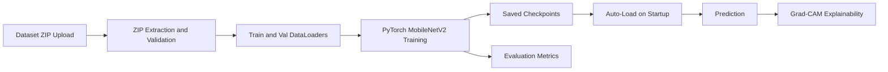

# AsanaAI Project Report
## Explainable Yoga Pose Recognition Using PyTorch and Grad-CAM

Course: CELBC608 - Data Science Laboratory
Semester: VI

---

## Abstract

AsanaAI is an explainable deep-learning application for yoga pose classification from still images.
The system uses transfer learning with MobileNetV2 in PyTorch and provides Grad-CAM overlays to
show which image regions influenced the prediction. The application is delivered through Streamlit,
supports dataset upload, model training, evaluation, and single-image inference in one interface.
To improve usability and reproducibility, trained checkpoints, class order, and training history are
persisted and auto-loaded on future runs.

Keywords: Transfer learning, MobileNetV2, Streamlit, PyTorch, Grad-CAM, explainable AI, multi-class classification.

---

## 1. Introduction

Incorrect yoga posture can lead to discomfort or injury, especially for beginners who practice without
expert supervision. An AI-based classifier can provide quick posture identification and visual evidence
of model reasoning, making learning safer and more accessible.

AsanaAI addresses this through:

- pose classification across 8 curated yoga classes
- visual explainability using Grad-CAM
- user-friendly workflow for upload, training, evaluation, and prediction

---

## 2. Problem Statement and Objectives

### Problem Statement

Build an image-classification system that identifies a yoga pose from a user-uploaded image and
explains the decision through attention visualization.

### Objectives

1. Train a robust multi-class classifier using transfer learning.
2. Provide comprehensive evaluation metrics for practical analysis.
3. Add Grad-CAM for interpretable predictions.
4. Persist model artifacts for reproducibility and reduced retraining overhead.

---

## 3. Dataset Description

Dataset source: curated subset from yoga posture images.

Class set used:

- downward_dog
- warrior
- tree
- cobra
- plank
- triangle
- child_pose
- seated_forward_bend

Expected input format for the app:

```text
yoga_dataset/
	train/<class_name>/*.jpg|jpeg|png
	val/<class_name>/*.jpg|jpeg|png
```

Typical split used in this project context:

- 96 training images per class
- 24 validation images per class
- 8 classes total

---

## 4. System Design

### 4.1 Application Modules

1. Dataset upload and ZIP extraction
2. Dataset summary and augmentation preview
3. Model training and checkpoint saving
4. Evaluation dashboards
5. Prediction with Grad-CAM explainability

### 4.2 Model Architecture

Backbone:

- `torchvision.models.mobilenet_v2` with ImageNet weights
- backbone initially frozen for head training
- staged fine-tuning by unfreezing deeper feature blocks in later epochs

Classifier head:

- Linear(in_features -> 128)
- ReLU
- Dropout(0.3)
- Linear(128 -> num_classes)

### 4.3 Training Configuration

- Framework: PyTorch
- Loss: CrossEntropyLoss with label smoothing (0.05), with class weighting enabled only if class imbalance is significant
- Optimizer: AdamW
- Learning rates: 5e-4 (head phase), 2e-5 (fine-tune phase)
- LR scheduler: ReduceLROnPlateau (factor=0.5, patience=1, min_lr=1e-6)
- Weight decay: 1e-4
- Gradient clipping: 1.0
- Batch size: 12
- Maximum epochs: 24
- Early stopping patience: 6
- Two-phase training: classifier-head warm-up followed by partial backbone fine-tuning
- Fine-tuning trigger: from epoch 10, unfreeze feature blocks from index 16 onward
- MixUp regularization: alpha 0.2 in the initial 10 epochs
- Device: CUDA (if available), otherwise CPU

---

## 5. Preprocessing and Augmentation

### Training transform pipeline

- RandomResizedCrop(160, scale=(0.85, 1.0), ratio=(0.85, 1.15))
- RandomHorizontalFlip
- RandomAffine(degrees=10, translate=(0.04, 0.04), scale=(0.95, 1.05))
- ColorJitter(brightness=0.12, contrast=0.12, saturation=0.08, hue=0.02)
- RandomAdjustSharpness(sharpness_factor=1.3, p=0.2)
- ToTensor
- Normalize(ImageNet mean/std)

### Validation transform pipeline

- Resize(184)
- CenterCrop(160)
- ToTensor
- Normalize(ImageNet mean/std)

Rationale:

- augment training data to improve generalization
- keep validation data clean for unbiased evaluation

---

## 6. Persistence and Reproducibility

AsanaAI saves these artifacts under `asanai_saved/`:

- `model_weights.pt`
- `training_history.json`
- `class_names.json`

On startup, if all three files exist, the app auto-loads the trained model and history.

Benefits:

- faster repeated usage
- consistent class-index mapping
- reproducible metric visualization

---

## 7. Evaluation Methodology

Validation inference outputs are cached and reused across metrics views.

### 7.1 Quantitative metrics

- overall validation accuracy
- confusion matrix
- precision, recall, F1-score, support (classification report)
- per-class accuracy
- one-vs-rest ROC curves and AUC

### 7.2 Qualitative metric

- Grad-CAM overlay inspection for focus-region relevance

---

## 8. Explainability with Grad-CAM

Grad-CAM is computed from the final convolutional layer in MobileNetV2 features.

Pipeline:

1. Forward pass on input image tensor.
2. Backward pass for the predicted class score.
3. Compute channel weights from pooled gradients.
4. Weighted sum of activation maps.
5. Apply ReLU and normalize with epsilon (`+1e-8`).
6. Resize and colorize heatmap.
7. Blend with denormalized original image.

This provides a visual explanation of model attention.

---

## 9. Application Workflow

1. Start Streamlit app.
2. Auto-detect GPU/CPU and show status.
3. Auto-load checkpoint if present.
4. Optionally upload dataset ZIP for training or retraining.
5. View EDA summary and augmentation preview.
6. Train model with progress updates.
7. Review training curves and evaluation tabs.
8. Upload single image for prediction with Grad-CAM.

---

## 10. Results Summary (What the App Produces)

The application displays:

- final train and validation metrics
- learning curves (loss and accuracy)
- confusion matrix heatmap
- classification report table
- per-class performance bars
- ROC curves (one-vs-rest)
- top-3 prediction panel
- all-class probability chart
- Grad-CAM heatmap and overlay
- pose guidance card with Sanskrit name, benefits, cues, and difficulty

Note:

- evaluation metrics require validation loader availability
- if only checkpoint is loaded, prediction works immediately but evaluation needs dataset upload

---

## 11. Engineering Highlights

1. Safe dataset extraction and validation logic for ZIP uploads.
2. Session-state driven UI flow without forced rerun hacks.
3. Best-weight restoration using deep-copied model state.
4. Two-stage transfer-learning strategy (head training then partial backbone fine-tuning).
5. Class-balanced loss and adaptive LR scheduling to improve validation generalization.
6. Cached evaluation inference to avoid duplicate forward passes.
7. Clear separation between training, evaluation, and prediction paths.

---

## 12. Limitations

1. Single-frame image classification cannot assess movement quality over time.
2. Performance depends on dataset diversity, image quality, and class balance.
3. Validation metrics are unavailable until validation data is loaded.
4. CPU training can be significantly slower than CUDA training.

---

## 13. Conclusion

AsanaAI demonstrates a complete and practical explainable-AI pipeline for yoga pose recognition.
The project integrates transfer learning, robust metric reporting, Grad-CAM visualization, and
checkpoint persistence in a single user-friendly Streamlit interface. It satisfies practical lab goals
for model development, analysis, and interpretability.

---

## 14. Future Scope

1. Automated hyperparameter search (augmentations, scheduler, and regularization sweeps).
2. More classes and larger, more diverse datasets.
3. Lightweight export and deployment paths.
4. Pose-keypoint based corrective suggestions.
5. Video-based sequence analysis for dynamic posture assessment.

---

## Appendix A - Reproducibility Steps

```bash
python -m venv .venv
pip install -r requirements.txt
streamlit run app.py
```

Optional sanity check:

```bash
python verify_pytorch_conversion.py
```

---

## Appendix B - Architecture Diagram (Mermaid)


